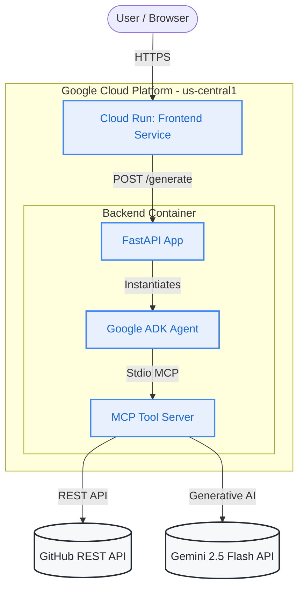

# GitHub Dev Card Generator

An AI-powered web application that generates premium, personalized developer showcase cards from public GitHub profiles. It uses Gemini 2.5 Flash to analyze a user's GitHub activity, repositories, and languages to infer their "Developer Vibe", top skills, and a fun fact.

## 🚀 Live Application

**[Access the Live App Here](https://github-card-frontend-675769433571.us-central1.run.app)**

You do **not** need to run anything locally to use the app! It is fully hosted in the cloud. Just open the link above, enter a GitHub username, and hit generate.

## 🏗️ Architecture & Infrastructure

The application is a fully serverless architecture deployed on **Google Cloud Platform (GCP)** using Cloud Run, billed to a GCP Trial Account.



### Core Components:
1.  **Frontend Service**: A static HTML/JS UI deployed via Docker (NGINX) to Cloud Run. It directly calls the backend Cloud Run service.
2.  **Backend Service**: A FastAPI Python application deployed to Cloud Run.
3.  **ADK Agent**: Orchestrates the tool calls using the Google Agentic Development Kit.
4.  **MCP Server**: Implements the Model Context Protocol tools to:
    *   Fetch rich data (repos, languages, stats) via the GitHub API.
    *   Analyze the profile using the Gemini 2.5 Flash API to extract insights.
    *   Generate the final HTML card with a premium, compact design.

## 💻 Local Development Workflow

If you want to modify the code and test it locally on your Mac:

1.  **Start the Backend**:
    Open your macOS terminal and run:
    ```bash
    cd /Users/kaustubhkar/.gemini/antigravity/scratch/github-card-generator/backend
    uvicorn main:app --reload --port 8080
    ```
2.  **Test the Local Server**:
    The backend will run on `http://localhost:8080`. 
    *(Note: Your frontend `index.html` is currently hardcoded to point to the live Cloud Run backend. If you want to test the full flow locally, you would need to temporarily change `API_BASE` in `frontend/index.html` back to `http://localhost:8080` and open the HTML file in your browser).*

## 🔑 Infrastructure & Scaling Details

*   **Hosting**: Both frontend and backend are deployed as Google Cloud Run services.
*   **Scaling**: Configured to scale down to `0` instances when not in use (costing $0) and up to a maximum of `5` instances under load.
*   **Docker Registry**: Images are stored in Google Artifact Registry (`us-central1-docker.pkg.dev`).
*   **APIs**:
    *   **Gemini**: Uses a paid-tier API key bound to the GCP Trial Billing Account to avoid free-tier quota limits (20 req/day).
    *   **GitHub**: Uses a Personal Access Token to avoid unauthenticated API rate limits.
